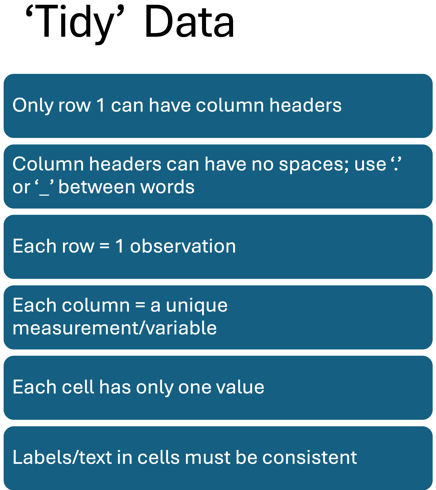
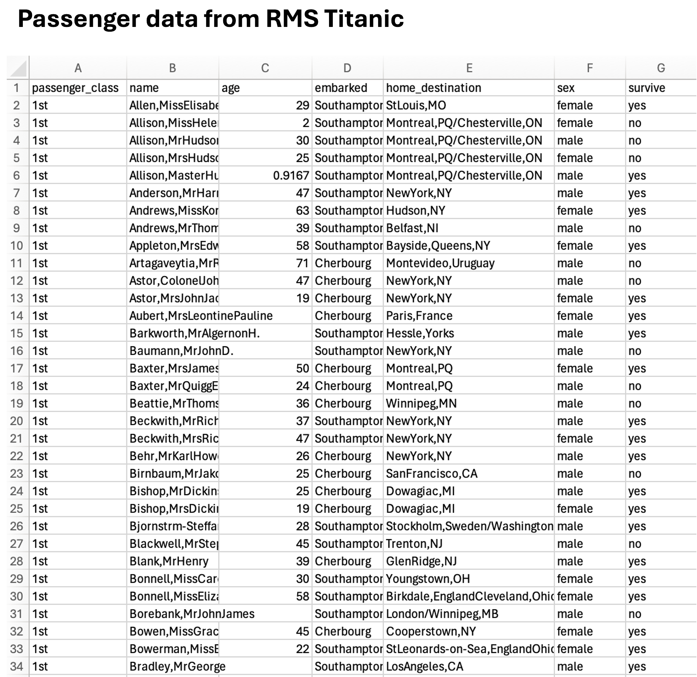
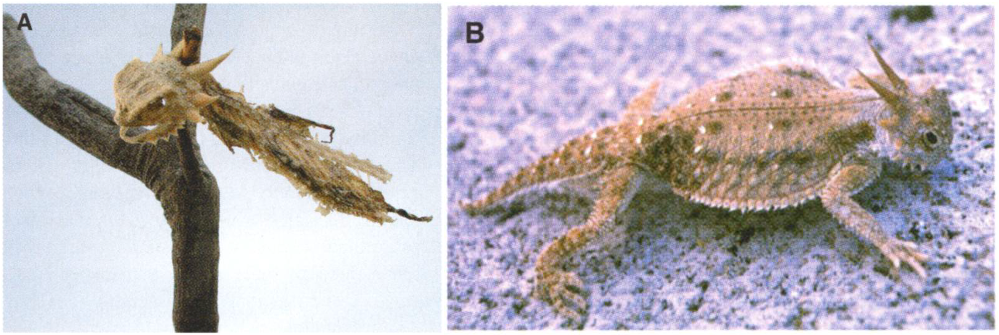
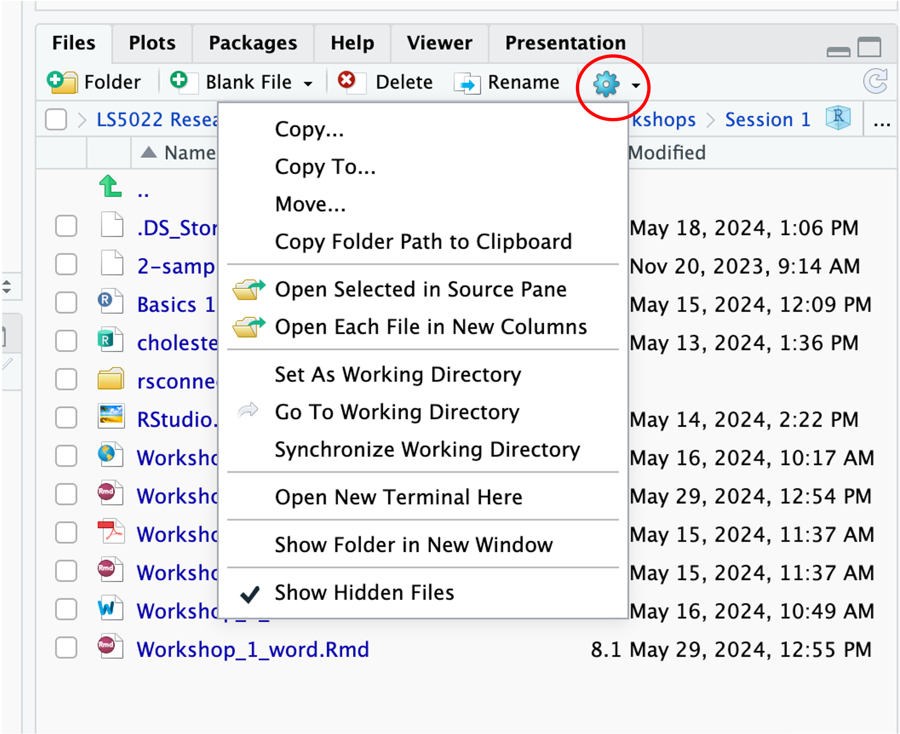

## Importing 'tidy' data to RStudio

This workshop is designed to get you started in importing Excel and csv spreadsheets to RStudio. The first thing you should do is to ensure that your spreadsheet is arranged in a 'tidy' format.<br>

You always need to load the packages that you need to use for a session:

::: {.callout-important appearance="simple" collapse="true" title="Click to see packages to load (Copy and paste to Script editor)" icon="true"}
```{r}
#| label: library.package
#| echo: TRUE
#| message: FALSE
#| warning: FALSE
library(tidyverse)
library(psych)
library(rio)
```
:::

```{r}
#| label: kable
#| echo: false
#| eval: true
#| results: false
library(tidyverse)
library(psych)
library(rio)
library(knitr)
```

<br> **CLICK ON THE TAB 'TIDY DATA' BELOW TO GET STARTED.**

:::::::::: panel-tabset
### Tidy data

In Excel, make sure your data is 'tidy' before trying to import it to RStudio. The basic rules of tidy data are:

{.lightbox width="50%"} <br><br><br> So, for example, this data of passengers on the RMS Titanic is tidy:

{.lightbox fig-align="centre" width="70%"} <br><br>

#### TASK:

1.  Go to Canvas and download the file [HornedLizards_unstacked.csv](https://kingstonuniversity-my.sharepoint.com/:x:/g/personal/ku11417_kingston_ac_uk/IQC41wwJVY_UQ5li6vlw36SHAZ4eTeqyVYca9SiVBzCWhDI?e=OWO0c5)

2.  Open the file in Excel and arrange the data to make it tidy in preparation for importing it to RStudio.

3.  Save the tidy file as `HornedLizards.csv`.

4.  In either RStudio Cloud or in RStudio on your laptop (depending on how you are using RStudio), create a new folder in the project 'LS5022 Biostatistics' and call it 'Session 2'. Set it as your **working directory**.

5.  Upload the `HornedLizards.csv` file to the new folder Session 2 (or move it to the working directory folder if you are using your own laptop). <br> <br>

*BACKGROUND*: <br> Horned lizards have spikes around the head. A study investigated whether or not the spikes protected lizards against predation by shrikes – birds that skewer its victims on thorns to save for eating later.<br>

They measured (a) length of horns on lizards skewered on spikes and (b) length of horns on lizards that were alive.<br>

{width="60%"}

### Import data to RStudio

Once you have prepared your *xlsx* or *csv* file for importing, you can import the file to RStudio. <br><br> `1.` First, in RStudio go to the folder where your excel or csv file is located (using the Files directory in RStudio).<br> Set this location (where the file is and where you want to save your work) as your **working directory** by clicking on the 'More' cog icon and selecting `Set As Working Directory`.<br>

{width="70%"}

<br>

`2.` Import the tidy 'HornedLizards.csv' file that you have created.<br>

The easiest way to import spreadsheets is to use the `import()` function from the *rio* package (use `install.packages("rio")` to install it if it is not already installed in your RStudio): <br>

```{r}
#| label: import
#| echo: TRUE
#| warning: FALSE
#| eval: true
HornedLizard <- import('HornedLizards.csv')  # <1>
```

1.  Imports the csv file and stores it as a dataframe object called `HornedLizard`

Here, the csv file is imported and stored in an object called 'HornedLizard'. This object is a dataframe. <br><br><br> `(a)` Use the `head()` function to see the 1st 6 rows of the dataframe:

```{r}
#| label: head
#| echo: TRUE
#| eval: false
head(HornedLizard)
```

::: {.callout-note collapse="true" title="Click to see the output" icon="false"}
```{r}
#| label: head1
#| echo: false
#| eval: true
head(HornedLizard) |>
  kable(align = 'l')
```
:::

<br> `(b)` You can view the entire dataframe in RStudio with:<br>

```{r}
#| label: view
#| echo: TRUE
#| results: FALSE
view(HornedLizard)
```

or even more simply by clicking the name of the dataframe in the Environment.

<br> `(c)` You can see summary descriptive data (using the `describeBy()` function from the *psych* package)

```{r}
#| label: summary
#| echo: TRUE
#| eval: false
describeBy(squamosalHornLength ~ Survival, data = HornedLizard) # <1>
```

1.  Gets descriptives statistics for the `squamosalHornLength` variable grouped by the `Survival` groups.

::: {.callout-note collapse="true" title="Click to see the summary output (scroll to the right to see all of the output)" icon="false"}
```{r}
#| label: summary1
#| echo: false
#| eval: true
describeBy(squamosalHornLength ~ Survival, data = HornedLizard) 
```
:::

<br> `(d)` We can see the data types of the variables here:

```{r}
#| label: type
#| echo: TRUE
#| eval: false
HornedLizard |>  #<1>
  summarise_all(class)
```

1.  Uses a 'pipe' (\|\>) to send the HornedLizard dataframe to the summarise_all(class) function.

::: {.callout-note collapse="true" title="Click to see the data types in each column" icon="false"}
```{r}
#| label: type1
#| echo: false
#| eval: true
HornedLizard |>
  summarise_all(class) |>
  kable(align = 'l')
```
:::

### Missing values

Missing values are imported as 'NA' in R.

You can see how many missing values are in any column with:

```{r}
#| label: wrangling
#| echo: TRUE
#| eval: false
HornedLizard |>
  summarise(count = sum(is.na(squamosalHornLength))) #<1>
```

1.  Pipes the HornedLizard dataframe to the summarise() function to count missing values ('na')

::: {.callout-note collapse="true" title="Click to see the missing values" icon="false"}
```{r}
#| label: wrangling1
#| echo: false
#| eval: true
HornedLizard |>
  summarise(count = sum(is.na(squamosalHornLength))) |>
  kable(align = 'l')
```

This code counts how many NAs appear in cells in the squamosalHornLength column in the dataframe.
:::

You can see that there is one row with missing measurements.

<br>You can view this row alone with the filter() function:

```{r}
#| label: filter
#| echo: TRUE
#| eval: false
HornedLizard |>
  filter(is.na(squamosalHornLength)) #<1>
```

1.  Pipes the HornedLizard dataframe to the filter() function which filters any rows with 'na' in the squamosalHornLength column

::: {.callout-note collapse="true" title="Click to see the rows with missing values" icon="false"}
```{r}
#| label: filter1
#| echo: false
#| eval: true
HornedLizard |>
  filter(is.na(squamosalHornLength)) |> 
  kable(align = 'l')
```
:::

<br> and you can remove this row with:

```{r}
#| label: filter_out
#| echo: TRUE
#| eval: true
HornedLizard <- HornedLizard |>
  filter(!is.na(squamosalHornLength)) #<1>
```

1.  Filters only those rows with no 'na' values <br> **NB** I have over-written the dataframe by storing this result without the NA values in the same dataframe name

**NB2** The following code will do the same thing:<br> `HornedLizard |>` <br> `drop_na(squamosalHornLength)`<br> (removing all rows with 'NA' in the *squamosalHornLength* column)

### Types of data

Data can be numeric, integer, character or factor. R attempts to identify the type when you import data:

- **Numeric** (with decimal places - shown as 'dbl') and **integer** are numeric data (dbl or int)

- **Character** is text (chr)

- **Factors** are when characters or numbers are used to identify categories or groups (fct)

<br>We can see what the data types are:

```{r}
#| label: glimpse
#| echo: TRUE
#| eval: false
HornedLizard |>
  summarise_all(class)
```

::: {.callout-note collapse="true" title="Click to see the data types" icon="false"}
```{r}
#| label: glimpse1
#| echo: false
#| eval: true
HornedLizard |>
  summarise_all(class) |> 
  kable(align = 'l')
```

Survival has been stored as character data.
:::

<br>However, the Survival consists of **categories** ('living' or 'killed'). So, we want to convert this column, Survival, to a **factor**, and save as an updated dataframe ('HL_revised'):

```{r}
#| label: factor_convert
#| echo: TRUE
#| eval: false
HL_revised <- HornedLizard |>
  mutate(Survival = as.factor(Survival))

HL_revised |>
  summarise_all(class)
```

::: {.callout-note collapse="true" title="Click to see the data types of the updated dataframe" icon="false"}
```{r}
#| label: factor_convert1
#| echo: false
#| eval: true
HL_revised <- HornedLizard |>
  mutate(Survival = as.factor(Survival))

HL_revised |>
  summarise_all(class)
```

Survival has been stored as factor data.<br> <br>If we had needed to change the squamosalHornLength variable column to numeric or integer data, we would use:

`HL_revised <- HornedLizard |>`<br> `mutate(squamosalHornLength = as.numeric(squamosalHornLength))`

or

`HL_revised <- HornedLizard |>`<br> `mutate(squamosalHornLength = as.integer(squamosalHornLength))`
:::

<br><br>FINALLY, now that the dataframe is cleaned and ready, save it as an *RData* file.

This means that you do not have to import the csv file and clean it up all over again! You can just upload the *RData* file which will provide the saved, updated dataframe.

```{r}
#| label: save_RData
#| echo: TRUE
#| eval: false
save(HL_revised, file = "HL_revised.RData")
```

This saves the RData file in your working directory.<br><br> To open the dataframe in future, either click on the *RData* file in the Files tab in the RStudio Files Directory or:<br> `load(file = "HL_revised.RData")`<br>

(assuming you have set this as your working directory again)

**Our data is now ready for analysis!**<br><br>

### Further information

1.  You can watch a short video in which I carry out the commands referred to in these notes in RStudio.<br> You can watch the video from Canvas [by clicking here](https://canvas.kingston.ac.uk/courses/30443/pages/session-2-importing-files-to-rstudio) <br><br>

2.  All of this and so much more is freely available in an on-line book called:<br> **R for Data Science** which can be found at:<br><br> [R for Data Science (click on this link)](https://r4ds.hadley.nz/)<br><br> This is a great reference source for using R to manage data. It also contains 3 chapters on creating graphic visualisations using the package ggplot2 which we will be using in later sessions.<br> It does not, however, include how to carry out statistical analyses.
::::::::::
